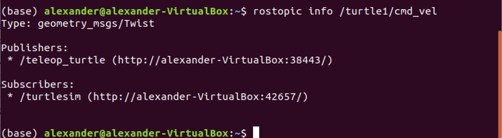
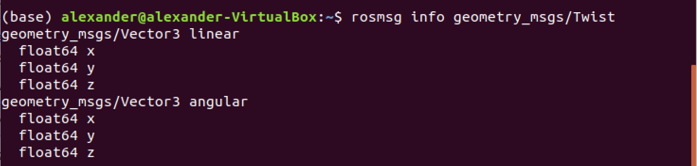

# Run the Turtlesim

### Step 1
To run the Turtlesim you will need to launch three separate terminal windows. In the first you need to run the Master process. It is necessary prior to running any ROS node. The Master process is responsible for the following (and more):

* Providing naming and registration services to other running nodes
* Tracking all publishers and subscribers
* Aggregating log messages generated by the nodes
* Facilitating connections between nodes

To run the master process, you must execute the command `roscore`

The output should be the following:

### Step 2

To launch Turtlesim run the command: `$ rosrun turtlesim turtlesim_node`

The expected output:

Now you can see the turtle

### Step 3

Use `$ rosrun turtlesim turtle_teleop_key` to move the turtle using arrows on the keyboard

### Step 4

If you want to list all the active nodes, run the command `rosnode list` in new terminal. The output should output the following information:

* `/rosout` This node is launched by roscore. It subscribes to the standard /rosout topic, the topic to which all nodes send log messages.
* `/teleop_turtle` This is our keyboard teleop node. Notice that it’s not named turtle_teleop_key. There’s no requirement that a node’s broadcasted name is the same as the name of it’s associated executable.
* `/turtlesim` The node name associated with the turtlebot_sim node

### Step 5

In a similar fashion you can list all the topics, by running `rosnode topics`. The expected output should be the following:

* `/rosout_agg` Aggregated feed of messages published to /rosout.
* `/turtle1/cmd_vel` Topic upon which velocity commands are sent/received. Publishing a velocity message to this topic will command turtle1 to move.
* `/turtle1/color_sensor` Each turtle in turtlesim is equipped with a color sensor, and readings from the sensor are published to this topic.
* `/turtle1/pose` The position and orientation of turtle1 are published to this topic.

### Step 6

To get topic infor use `rostopic info [name_of_topic]` for example the output of `rostopic info /turtle1/cmd_vel` will be the following:

As would be expected, there are two nodes registered on this topic. Our publisher, the teleop_turtle node, and our subscriber, the `turtlesim` node. Additionally, we can see that the type of message used on this topic is `geometry_msgs/Twist`.

### Step 7

Let’s get some more information about the `geometry_msgs/Twist` message on the `/turtle1/cmd_vel` topic, to do so, we will use the `rosmsg info` command.

We can see that a `Twist` message consists nothing more than two `Vector3` messages. One for linear velocity, and another for angular velocities, with each velocity component being represented by a float64.

**Note:** Sometimes, the message definition won’t provide an ample amount of detail about a message type. For example, in the example above, how can we be sure that linear and angular vectors above refer to velocities, and not positions? One way to get more detail would be to look at the comments in the message’s definition file. To do so, we can issue the following command: `rosed geometry_msgs Twist.msg`.

**Note 2:** More information about rosed, including how to select which editor is used by default can be found [here](http://wiki.ros.org/ROS/Tutorials/UsingRosEd).

### Step 8

Sometimes it may be useful to look at a topic’s published messages in real time. To do so, we can use the command `rostopic echo`. Let’s take a look at the `/turtle1/cmd_vel topic`.

`$ rostopic echo /turtle1/cmd_vel`

If we then command the turtle to move from the `turtle_teleop_key` window, we will be able to see the output message in real-time.
