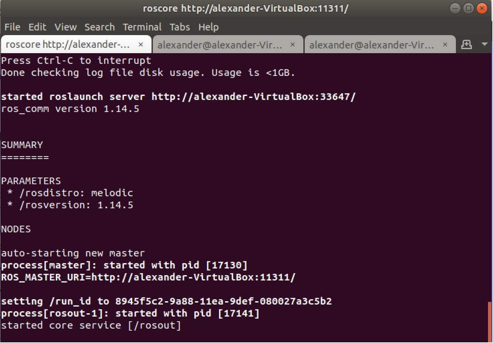
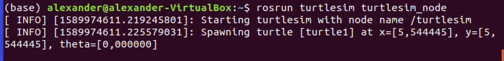
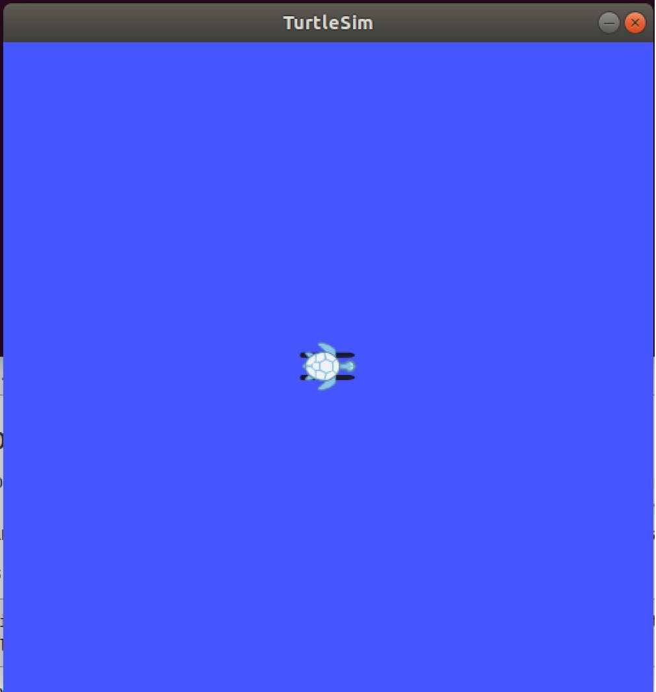

# Run the Turtlesim

### Step 1
To run the Turtlesim you will need to launch three separate terminal windows. In the first you need to run the Master process. It is necessary prior to running any ROS node. The Master process is responsible for the following (and more):

* Providing naming and registration services to other running nodes
* Tracking all publishers and subscribers
* Aggregating log messages generated by the nodes
* Facilitating connections between nodes

To run the master process, you must execute the command `roscore`

The output should be the following:

### Step 2

To launch Turtlesim run the command: `$ rosrun turtlesim turtlesim_node`

The expected output:

Now you can see the turtle

### Step 3

Use `$ rosrun turtlesim turtle_teleop_key` to move the turtle
